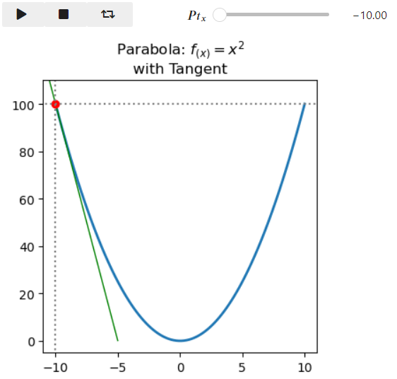

# my Tests with `ipywidgets`

The notebook give step-by-step example on how to use the `ipywidgets` `FloatSilder` and `Play` for your `matplotlib` diagrams to allow some user interactions.

- Examples: [ipywidgets @ read the docs - examples >> interact()](https://ipywidgets.readthedocs.io/en/stable/examples/Using%20Interact.html)

- Installation: [ipywidgets @ read the docs - Installation](https://ipywidgets.readthedocs.io/en/stable/examples/Using%20Interact.html)


## imports
You need an inline statement and some python libraries to import:
``` Python
%matplotlib inline

import matplotlib.pyplot as plt
import ipywidgets as widgets
from IPython.display import display
from matplotlib.lines import Line2D
``` 

## The diagram as a function by `matplotlib` figure
Approach to make your diagram / figure by a fuction: 
  1. initally just code you `matplotlib` based diagram / figure 
  2. indent that block
  3. before 1st line: make a `def function(parameters):` line
  4. add a return; the `return(plt.show()`

you will get somthing like

``` python
def show_diagram(pt_x=0):
    # the figure, axes 
    fig = plt.figure(figsize=(4,4))
    ax = fig.add_subplot(111)
    ...
    ... 
    ...
    # show the diagram
    return(fig.show())

show_diagramm(0)
```


## `FloatSlider`
With the `FloatSlider` you can manipulate the parameter for displaying your figure.

Use `widget.interact(<function_name>, <variable> = (min, max))`

e.g.:

``` python
widget.interact(show_diagram, pt_x = (-10, 10));

```

or with some more details
``` python
widgets.interact(show_diagram,
                 pt_x=widgets.FloatSlider(min=-10, 
                                          max=10, 
                                          step=0.25, 
                                          value=0,
                                          description='$Pt_{x}$',
                                          continuous_update=True));
```


## `Play`
 
With `Play` you start the the generation and dsiplay of your diagrams from min to max given parameter, figure sequence.

``` python
widgets.interact(show_diagram, pt_x=widgets.Play(value=-10,
                                                 min=-10,
                                                 max=10,
                                                 # step minimum == 1 (int only)
                                                 step=1,
                                                 # time betwenn steps in millisec
                                                 interval=250,
                                                 description="Press play",
                                                 disabled=False # to enable the widget
                                                ));
``` 


## Together `Play` and `FloatSlider`

Interact with both widgets jslinked

  1. to play the sequence, or
  2. stop it any time and manipulate by mouse
  
``` python  
play = widgets.Play(value=-10,
                 min=-10,
                 max=10,
                 step=1,         # step minimum == 1 (integers only)
                 interval=250,   # time between steps in millisec
                 description="Press play",
                 disabled=False) # to enable the widget

fslider = widgets.FloatSlider(min=-10, 
                              max=10, 
                              step=0.25, 
                              value=0,
                              description='$Pt_{x}$',
                              continuous_update=True)

widgets.jslink((play, 'value'), (fslider, 'value')) # the jslink
ui = widgets.HBox([play, fslider]) # to display them apart horizontally

def f(play, fslider):
    # as widgets are jslink_ed we only need one of them
    show_diagram(play)

out = widgets.interactive_output(f, {'play': play, 'fslider': fslider})

display(ui, out) # the output
```


